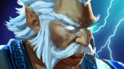

.. One Versus Five documentation master file, created by
   sphinx-quickstart on Sun Jan 24 20:31:14 2021.
   You can adapt this file completely to your liking, but it should at least
   contain the root `toctree` directive.

One Versus Five
========================================

这里记录与了我和朋友与 Dota 2 的「`天地星`_」机器人脚本进行 1v5（one versus five，即一个玩家对战五个机器人）对战的探索记录。

.. note:: 《Dota 2》是一款由Valve开发免费的\ **多人在线战斗竞技类**\ （MOBA 类）游戏，一场 Dota 2 游戏的两方通常都由五名玩家组成，即“五打五”。游戏中还支持机器人脚本，使得玩家可以与由机算机控制的机器人对战。

.. note:: 一般来说，Dota 2 的机器人不会非常强，一个熟练的玩家操纵多数英雄，都能以一人之力对抗五个机器人，即“一打五”。而「`天地星`_」是一款尤其强大、又设计独特的 Dota 2 机器人脚本，由\ `决明子`_\ 制作。「`天地星`_」机器人组成的对伍，在当对面只有一位玩家时，会采取十分针对玩家的战术，充分利用机器人的\ **超短反应时间**\ 、\ **秒速操作**\ 与\ **人数优势**\ ，来碾压玩家。要“一打五”战胜天地星队伍，需要一定的英雄理解与独到的战术。

我们对许多英雄进行了尝试，并且将成功的英雄记录在这里。战局记录、版本号、打法建议都包含在里面。

.. _天地星: https://steamcommunity.com/sharedfiles/filedetails/?id=1573671599
.. _决明子: https://steamcommunity.com/profiles/76561198859774278/myworkshopfiles/?section=collections&appid=570

强攻型
----------------------------------------

这类英雄能通过在游戏早期大量屠杀敌方英雄而建立优势，并且让对方没有足够的经济购买关键装备（刃甲、天堂之戟等），从而取得能够正面一打五的能力，进而取胜。

牵制型
----------------------------------------

这类英雄很难正面打过五个敌方英雄，但是可以通过不断地推进兵线来逼迫敌人来回守塔，并最终将敌方三路全部磨掉，令敌方机器人疲于守超级士兵，从而输掉比赛。

.. image:: icons/earth-shaker.png
   :alt: The hero icon of Earth Shaker.
   :width: 25%
   :target: heroes/earth-shaker.html

.. image:: icons/drow-ranger.png
   :alt: The hero icon of Drow Ranger.
   :width: 25%
   :target: heroes/drow-ranger.html

全部英雄索引
----------------------------------------

.. toctree::
   :maxdepth: 0

   heroes/drow-ranger
   heroes/earth-shaker
   heroes/zeus

Indices and tables
==================

* :ref:`genindex`
* :ref:`modindex`
* :ref:`search`
